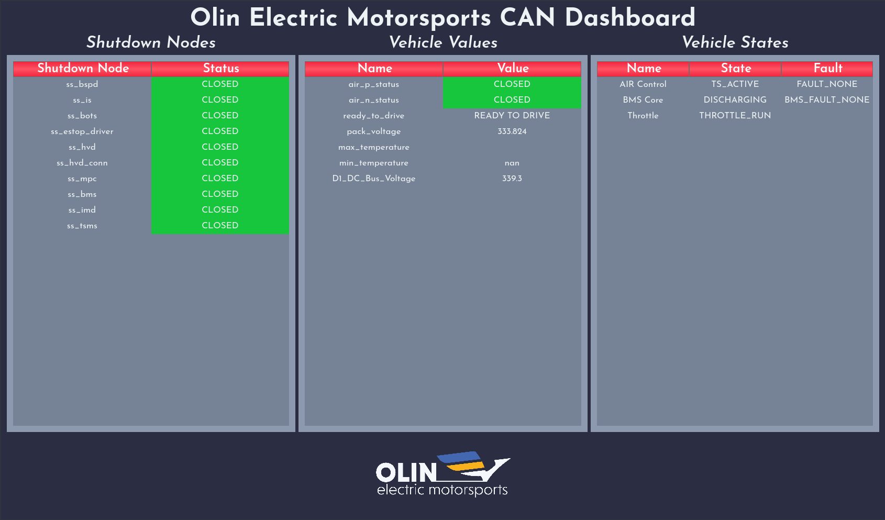

I built a Qt-based CAN Dashboard for [Olin's Formula SAE Team](https://www.olineelctricmotorsports.com) with a heavy focus on usability, maintainability, and expandability.

{{}}

## Features

The dashboard allows engineers to quickly and easily get live CAN information to debug our vehicle systems. It is extremely flexible, and can be used at any level, from just monitoring the messages from a single board to those from a particular enclosure or module to the entire car all at once.

A primary reason for this is that the dashboard is entirely customizable through a single YAML file and there are no hardcoded message or signal names anywhere in the codebase.

Users can specify which messages should appear, what column they should be in, and specify processing functions to transform raw message data before displaying, such as in the case of the temperatures, which are reported as a voltage by our BMS but translated to degrees for display.

```yaml
---
# Example Vehicle Values Configuration
ready_to_drive:
pack_voltage:
max_temperature:
  processing_function: convertVtoT
min_temperature:
  processing_function: convertVtoT
TorqueRequest:
```

## Under the Hood

The dashboard was primarily built using __Python__.

On the backend, the `python-can` and `cantools` libraries are used to receive raw CAN messages through a CAN dongle and parse them using our custom DBC (CAN Database) file. The system natively supports a few different types of dongles (including socketcan, seeedstudio, and slcand) through command line arguments to accomodate their usage on our team.

These then update state dictionaries created from the specifications in the YAML file and pass them on to the GUI, created with PyQt 5.

## Motivation

Prior to the dasboard's creation, getting CAN data off of the car required a series of verbose terminal commands to bring up and enable a CAN interface, read the messages from it, and pipe the raw hex into a decoder. This led to the consequence of few engineers on the team having the know-how to read CAN data from the vehicle.

Even for those who were experienced, the terminal interface was not ideal for monitoring the values of more than 1 message at a time, as otherwise the text would fly across the screen at an unintelligible rate.

The dashboard solves those problems and makes the CAN debugging process accessible to all of the engineers on our team, and makes it much simpler to monitor the state of a complex system with multiple components, or even the entire car.

## Next Steps

The biggest step forward I hope to take with this dashboard is to work with our data and sensing team to incorporate graphing capabilities so we can not only see a signal's current value, but also track how it changes over time, further accelerating our integration and debugging process.

