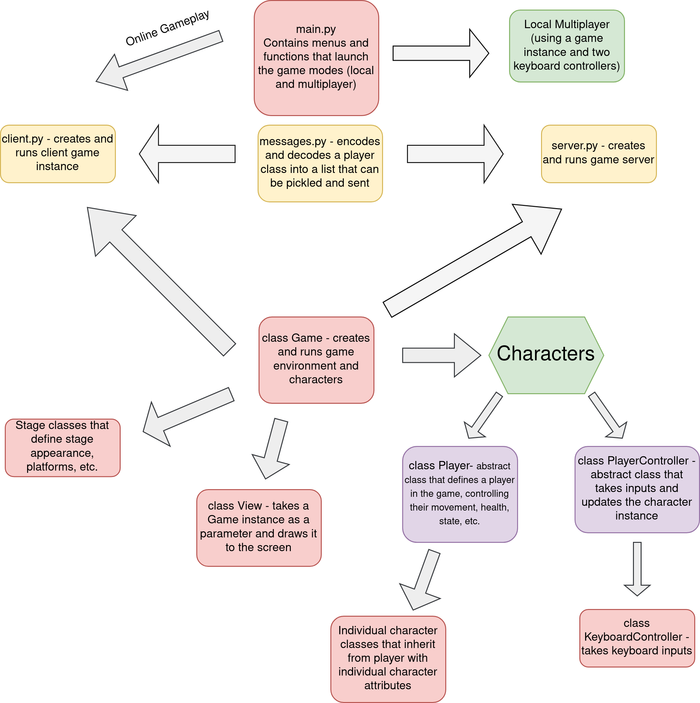

As a final project in my Software Design class, our team created a Super Smash Bros clone in __Python__ that was playable over online multiplayer.



## The Game

Super Smash Bros is a crossover fighting game series originally developed by Nintendo. However, instead of depleting an opponent's health bar, the goal is to increase their damage and eventually knock them off of the stage with a powerful attack.

## Under the Hood

The actual gameplay portion was built using __PyGame__. The code is structured according to the Model, View, Controller (MVC) architecture, with a focus on easy expandability to the game.

The netwoked portion of the game follows the client-server model. There is one instance acting as a server, which serves as the single source of truth for the game, and the players connect as clients, and can control their own characters. The process looks a bit like this:

1. The server is run as a separate instance from the clients - when it starts, it initializes the socket connection and waits to receive connections from two players.
2. Once it does, the two clients exchange information through the server so they know which player they are (player 1 or player 2) and who they are playing against so they can display them properly.
3. The central game model runs on the server - it handles all of the game calculations and serves as the single source of truth for the game's state that it then broadcasts to the clients
    1. The clients, on the other hand, handle the view and the controller. They capture the player's inputs and encode their character's state according to our custom message protocol and send that off to the server.
    2. The server, having received this information from both clients, integrates it into its master copies of the game and checks for any actions, such as attacks. If any have taken place, it makes any necessary calculations and sets the characters' states accordingly (for instance, if a character is hit by an attack, they need to be knocked back, so the server will perform all the relevant calculations and set the character's state accordingly.
    3. The server will then encode and braodcast this master game instance to both of the clients who then display to each of their respective screens.
    4. This cycle is repeated 60 times per second until one player has depleted all three of their lives.

{{}}

## Project Links
[[ Project Website ]](https://olincollege.github.io/pysmash/)  
  
[[ Project Github ]](https://github.com/olincollege/pysmash)
