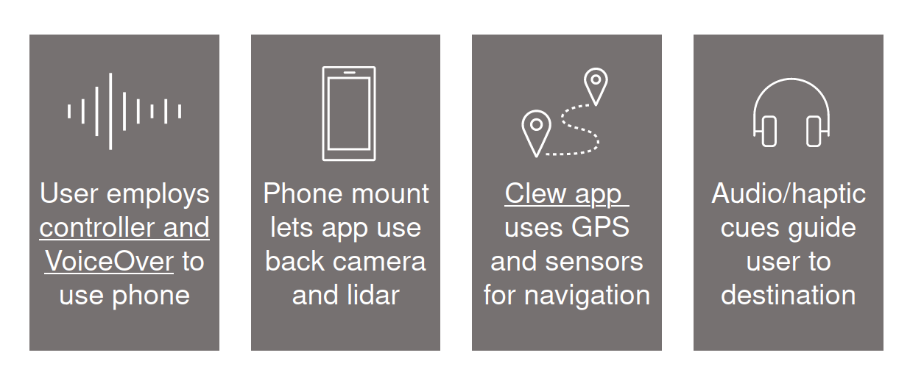
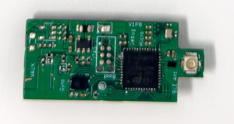
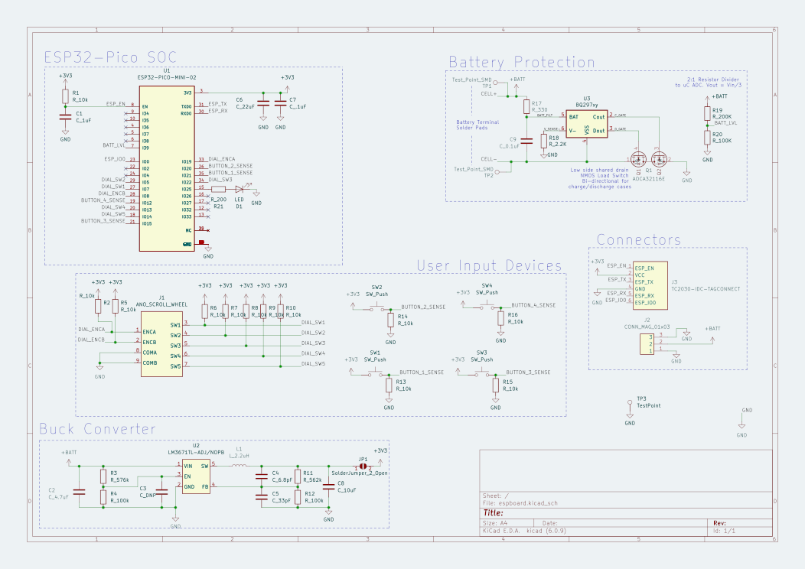
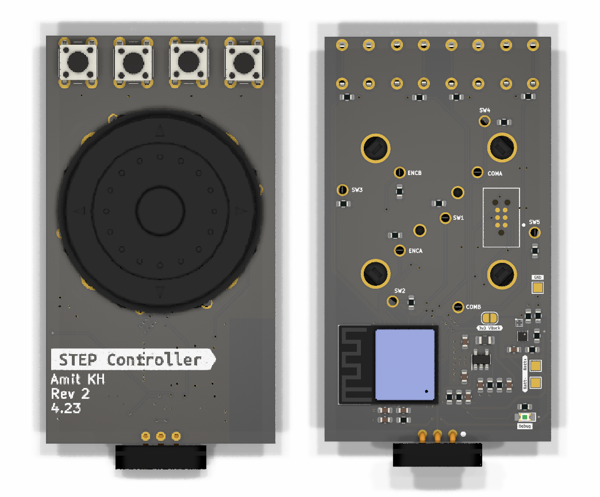

## What is STEP?
STEP, which stands for **S**ocial **T**echnology and **E**ntrepreneurship with **P**urpose, is an experimental, impact-centered education class at [Olin College of Engineering](https://www.olin.edu), centered around developing navigation technology for blind and visually impaired (BVI) users.

## What is the problem?
More specifically, we are developing AR systems for high-precision navigation. Imagine you get dropped off from a Lyft in downtown Manhattan as a blind individual - how would you navigate the the door of your destination? Or say your destination was Grand Central Terminal - how would you navigate the terminal itself? These last 100 steps are often the most difficult, so the STEP system attempts to solve this last block problem  by providing that high precision navigation solution.

## The STEP System
The system we are developing is smartphone-based to leverage technology that our users likely already own, and has 3 main components:
1. A phone mount that allows our navigation software to use the phone's LiDAR sensor and camera
2. A physical, hand-held controller that employs VoiceOver, allowing the user to control their phone without needing to touch or hold it.
3. [Clew](http://www.clewapp.org/), an application developed by a research group at Olin College of Engineering and adapted for use with our system.

{{}}

 ## Controller
 I primarily worked on the electrical and firmware systems for phone controller, so I'll focus on that here.

 ### Requirements
 After engaging with several potential users of this product, and considering our own engineering capabilities, we came up with a few design requirements for our controllers.
 - Must be comfortable to use
 - Must be intuitive to use and learn
 - Must not interfere with use in day to day life

 From these requirements, the design we settled on was a unit that would connect to the phone over Bluetooth Low Energy (BLE), and send commands to the phone's VoiceOver system, which would allow BVI users to control the entire phone in a manner they are likely to be familiar with.

 ### Revision 1
 This is actually the second year that STEP has been run, so for our first revision, we focused on building off of that work. We first designed a test board using the same microcontroller, the STM32 WB55, which has BLE capabilities. A fellow engineer designed the PCB, while I worked on the firmware.

 However, we quickly realized that our choice of hardware wasn't the best for this project. The chip we chose wasn't the easiest to write code for, and it lacked a built-in antenna, meaning we would have to design one ourselves; something that would require lots of time-consuming testing and validation.

{{}}

 ### Revision 2
 Thus, we decided to switch to using an ESP32, a low-power and low-cost system-on-a-chip that includes integrated Wifi and Bluetooth peripherals for our second revision. This is a system that our team was comfortable working with and had a built-in antenna, and was actually cheaper than our previous chip, at the cost of a little bit of power consumption and total size.

 I designed the PCB for this version, starting with the schematic, which is a blueprint for how all of the components will connect to each other without needing to worry about where they will be placed on the board.

{{}}

 I then created the board layout - that is, in conjunction with our mechanical design team, designed how the components would actually be laid out on our board, from the ESP32 to all of the buttons and the dial.

{{}}

 Once I was happy with the layout, I shipped the board for production, assembled it, and installed it into the final controller!
 // will insert image of final controller here

 We then presented our final system to the fine folks at Perkins School for the Blind, and are excited by the future possibilities of this project, such as spinning it off into a standalone, viable company!

 // insert image from our Perkins visit here

[[ PROJECT LINK HERE ]](https://github.com/olinstep)

