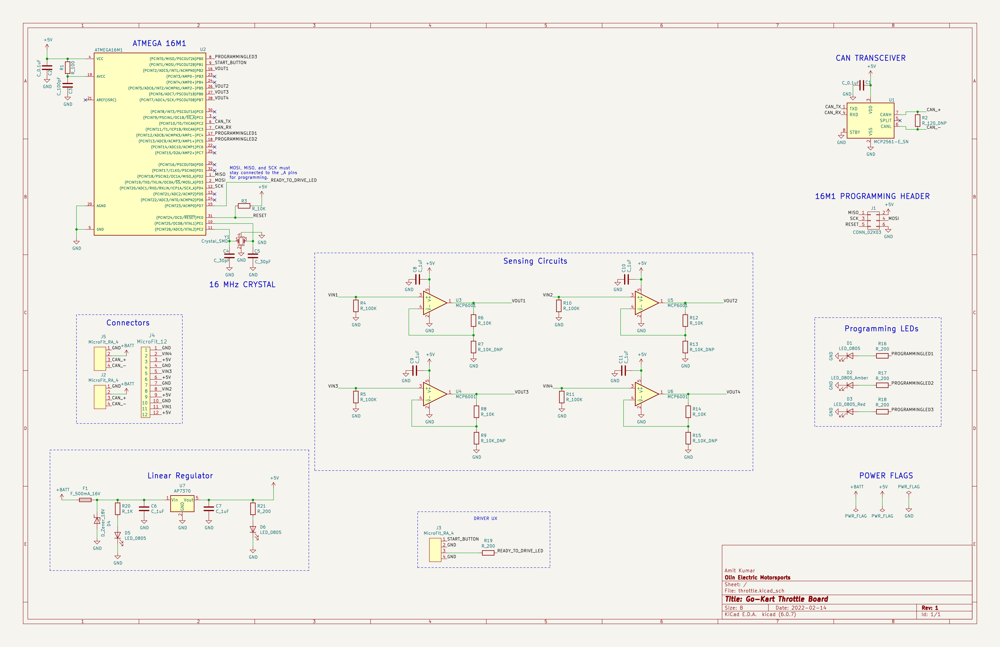
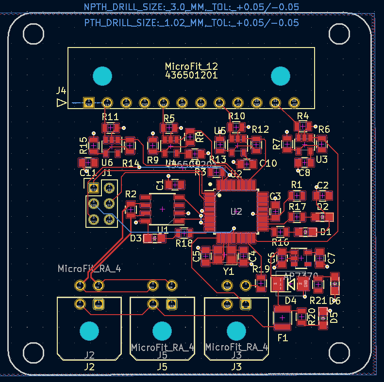
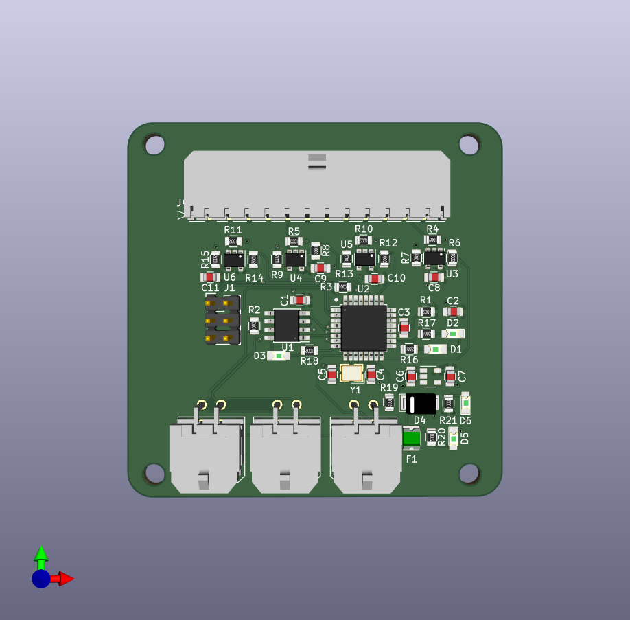

One of my first-year projects on [Olin's Formula SAE Team](https://olineelctricmotorsports.com) was designing the throttle circuit board for our secondary research Go-kart. The throttle circuitry is responsible for reading the amount the throttle pedal is pushed, and the onboard microcontroller does some safety checks and translates that into a torque request from the motor controller to make the car go!

## Where to start?

This was my first electrical engineering project, and while I had a bit of background by this point on what the board needed to do, it was tough to translate that conceptual understanding into a set of components that could accomplish that task.

I started with the schematic design, which is sort of like a blueprint that shows what all of the components on the board are without having to worry about how they'll be laid out on an actual board. I broke up my schematic into a few different functional blocks:
- The Atmega 16m1, the microcontroller we use on our team, and its accompanying crystal and circuitry
- The CAN transceiver used to send and receive CAN messages
- The linear regulator used to convert our 12V battery power to the 5V our components used
- The analog sensing circuits, which are non-inverting opamps that feed into the analog-to-digital converter pins onboard the 16m1
- A few other miscallenous bits and bobs, including the header used to flash the board with firmware, the connectors that would be present, and some LEDs to use for debugging firmware

{{}}

## The Layout

The next step was designing the board's layout. This was by far the trickiest step, as now I had to take that list of components and lay them out on a circuit board. The reason I found it difficult is because I had to keep in mind a varying list of constraints that were sometimes didn't have a straightforward solution.

For example, I wanted to make the physical footprint of the board no larger than it needed to be, and also have all of the traces (connections on the circuit board) be as short as possible. But certain signals are also susceptible to noise, so I had to make changes to move those farther away from components that had a tendency to produce noise. Minimizing the number of vias (a small hole that's used to make a connection to another layer of the board, which is useful when two traces need to intersect to get to their destinations) was also important.

Ultimately, it took a few revisions, but I ended up with a layout I was happy with and was ready to ship for production.

{{}}

{{}}

## Final Results

While the gokart vehicle itself was never finished as we ended up in a time crunch to finish our main vehicle by competition time, I did end up shipping this board and populating it for installation! Even though I wasn't able to see it working, it was still a great introduction into hardware design, which is something that I'll be overseeing in my current postion on the team as LV systems lead.

