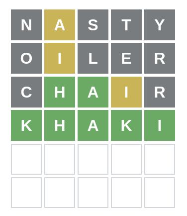
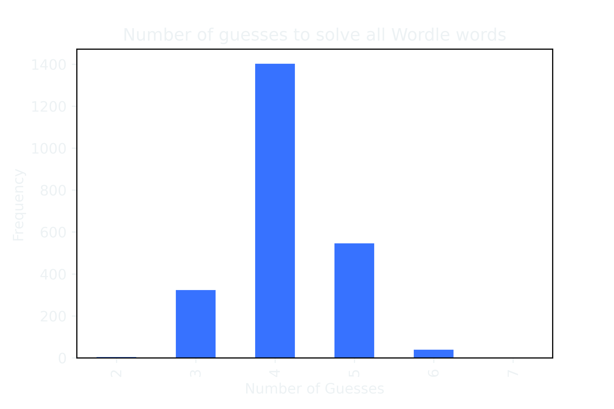

I built a [Wordle](https://www.nytimes.com/games/wordle/index.html) solver using __Python__ and information theory inspired by [3Blue1Brown](https://www.youtube.com/watch?v=v68zYyaEmEA) that solved a word in an average of 4.12 guesses.

Wordle is a popular word game that rose in popularity in early 2022. As a fun project and inspired by the video linked above, I decided to try my own hand at creating a solver using some of those techniques and implement it as a CLI.

{{}}

## How it Works

For each guess, the solver will run through all of the available 5 letter guesses, and using a combination of the guess' _expected information given_ (the average amount the resultant pattern from this guess will reduce our search space, weighted by the likelihood of each possible pattern ocurring) and word frequency data that tells us how likely a particular word is to be common enough to be a Wordle answer, select whatever guess gives the lowest expected number of guesses.

It repeats this process until it guesses the word or reaches its 10 guess limit.

## The Results

My solver was able to correctly guess the word in an average of 4.12 tries, and only failed to guess the word within Wordle's six-guess threshold one time (that word was "ferry", and it took 7 guesses). The full results can be seen in the graph below.

{{}}

## Project Links 
[[ PyPi Link ]](https://pypi.org/project/amitkh-wordle/)  
  
[[ Github Link ]](https://github.com/amit-kumarh/wordle-solver)

